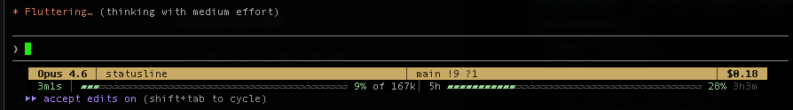

# claude-statusline

A custom statusline for [Claude Code](https://docs.anthropic.com/en/docs/claude-code) written in Rust. Shows model, cost, duration, git branch, context usage, and more — rendered as a two-line bar with ANSI colors.



Run it directly to see a demo preview with test data:

```
claude-statusline
```

## Build & Install

```
make install
```

Installs to `/usr/local/bin/claude-statusline`.

## Configure Claude Code

Add to `~/.claude/settings.json`:

if you use a global available path like /usr/local/bin you can omit the path

```json
{
  "statusLine": {
    "type": "command",
    "command": "/path/to/claude-statusline"
  }
}
```

## Features

**Line 1** — model name, directory, git branch + status (staged/modified/untracked), agent name, cost, permission mode

**Line 2** — session duration, context window gauge (adjusted for autocompact buffer), 5h/7d usage limits with progress bars and reset countdowns, lines added/removed

### Edge cases handled

- **Multiple Claude installations** — Supports `CLAUDE_CONFIG_DIR` for side-by-side setups (e.g. API key + subscription). The OAuth token lookup hashes the active config dir to find the correct keychain entry.
- **Subscription vs. API key accounts** — Subscription installs get usage limit bars (5h / 7d) fetched from the Anthropic OAuth API. API key installs gracefully skip usage fetching (no keychain entry = no bars, no errors).
- **Accounts without 7-day limits** — Some subscription tiers only have a 5-hour window. The 7d bar is simply omitted when the API returns `null` for `seven_day`.
- **Context window accuracy** — The gauge accounts for Claude Code's ~33k autocompact buffer, showing percentage of *usable* capacity rather than raw window size. 100% = autocompact will trigger.
- **Three-tier usage cache** — Fresh (< 2min): serve instantly. Stale (2–5min): serve stale + background refresh. Very stale (> 5min): sync fetch with 4s timeout, fallback to stale data. Cache auto-invalidates when a usage window resets.
- **Git timeout protection** — Git operations run in a separate thread with a 500ms timeout. Slow repos (large monorepos, network mounts) won't block the statusline.
- **Crash resilience** — The entire `run()` is wrapped in `catch_unwind`. A statusline must never crash the host terminal.
- **Responsive layout** — Columns use a flex-grow distribution system. Sections gracefully drop at narrow terminal widths (agent < 100 cols, mode < 80 cols, lines changed < 125 cols, 7d bar < 100 cols).
- **Per-session color palette** — Each session gets a deterministic color from a 12-color palette, hashed from session ID or cwd, so concurrent sessions are visually distinct.

## Debug

Pass `--debug` to dump raw JSON input to `/tmp/claude-statusline-debug-<session>/`.
